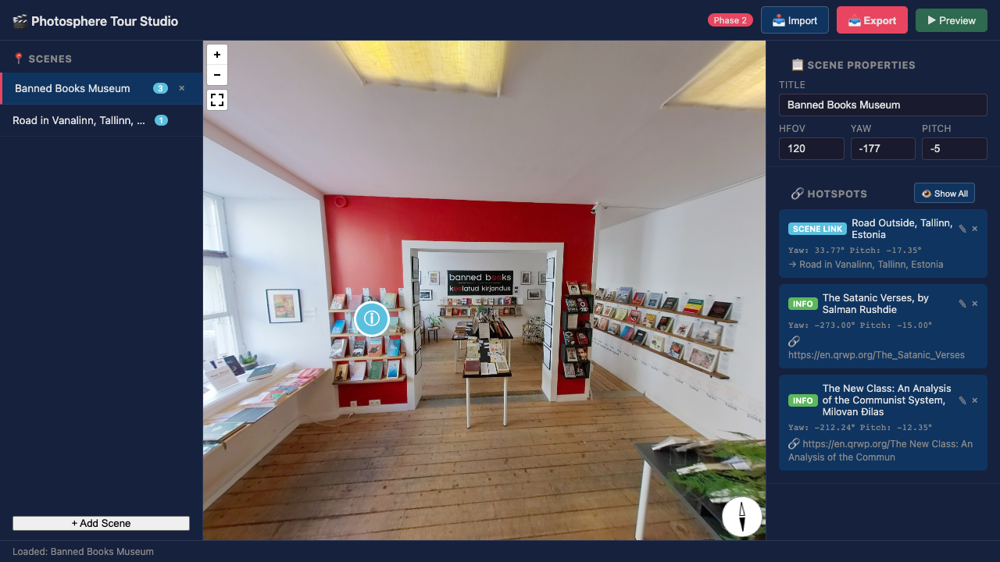

# Wikimedia Photosphere Tours

> Taking Pannellum — an excellent 360° panorama viewer — and building the missing authoring environment to create collaborative, wiki-based virtual tours for Wikimedia Commons.

## The Problem

Wikimedia Commons hosts thousands of 360° equirectangular photos taken on cameras like the Insta360 series. The `{{Pano360}}` template lets you view any single photo in Pannellum via `panoviewer.toolforge.org`. But there's no way to **link photos together** into a walkthrough tour — stitching scenes with clickable hotspots that navigate from one 360° photo to another, the way commercial tools like [Kuula](https://kuula.co/) and [Matterport](https://matterport.com/) do.

Pannellum has built-in [tour support](https://pannellum.org/documentation/examples/tour/) and [custom hotspots](https://pannellum.org/documentation/examples/custom-hot-spots/) — but **no authoring environment**. Creating a tour means hand-editing a JSON configuration file with yaw/pitch coordinates for every hotspot. There's no way to click in the viewport to place a hotspot, no scene management, no preview.

## What We Built



A full authoring pipeline for collaborative photosphere tours:

```
┌──────────────────────┐     ┌──────────────────────┐     ┌──────────────────────┐
│   Wikimedia Commons   │     │    Tour Server        │     │    Browser            │
│                       │     │    (Node.js)          │     │                       │
│  Wiki page (TOML/JSON)│────→│                       │────→│  Pannellum Viewer     │
│  Tour definition      │     │  • Parse TOML/JSON    │     │  • 360° rendering     │
│                       │     │  • Resolve File: refs │     │  • Scene navigation   │
│  360° photos          │     │  • Cache images       │     │  • Wikipedia cards    │
│  (JPEG, equirect.)    │────→│  • Serve via /images/ │────→│                       │
└──────────────────────┘     └──────────────────────┘     └──────────────────────┘
                                       │
                                       │  Tour JSON
                                       ▼
                             ┌──────────────────────┐
                             │   Visual Studio       │
                             │                       │
                             │  • Click-to-place     │
                             │    hotspots           │
                             │  • Scene management   │
                             │  • Import / Export    │
                             │  • Live preview       │
                             └──────────────────────┘
```

### Phase 1: Tour Viewer ✅
- Wiki-backed tour definitions (pages on Commons)
- Dual TOML + JSON format with auto-detection
- Pannellum rendering with scene transitions
- Wikipedia rich info cards on hotspot hover

### Phase 2: Visual Studio ✅
- Click in the 360° viewport to capture hotspot coordinates (yaw auto-normalized to [-180, 180] per Pannellum spec)
- Add/edit/delete scenes and hotspots
- Import from Commons wiki pages
- Export as JSON (download or copy) — select "Entire project" or "Current scene only"
- Export resolves panorama paths to original Commons URLs (not cached `/images/` paths)
- Preview tours in a new tab
- Red ➤ / blue ⓘ hotspot icons in the viewport
- JSON validator: `node scripts/validate-pannellum.mjs <file.json> [--fix]`

## Quick Start

```bash
cd prototype
node tour_server.mjs
# Open http://localhost:8765/studio.html
# Demo: http://localhost:8765/studio.html?page=User:Fuzheado/Panellum_Tour
```

**Requires**: Node.js 18+ (zero external dependencies — uses only built-in modules)

**Run tests**:
```bash
npx playwright test --project=chromium  # Requires @playwright/test installed
```

## Project Structure

```
photospheres/
├── prototype/              # Working code
│   ├── tour_server.mjs     # Server (entry point)
│   ├── tour_viewer.html    # End-user viewer
│   ├── studio.html         # Visual editor UI
│   ├── studio.js           # Editor logic
│   └── tour_config.php     # Standalone PHP equivalent (reference only, not deployed)
├── adr/                    # Architecture Decision Records
├── RESEARCH_REPORT.md      # Library landscape analysis
├── PRD.md                  # Product requirements
├── DEVELOPMENT.md          # Build status + roadmap
├── DEBUGGING.md            # Visual debugging with playwright-cli
├── HANDOVER.md             # Session handover notes
├── tests/                  # Playwright test suite
│   └── studio-behaviors.spec.js  # Studio interaction behavior tests
├── playwright.config.js    # Playwright configuration
├── scripts/                # Utility scripts
│   ├── dump-state.js       # Playwright state introspection
│   └── validate-pannellum.mjs  # Pannellum JSON Schema validator + auto-fix
```

## Tour Definition Format

Tours are stored as wiki pages on Commons. Two formats supported:

**TOML** (hand-editing friendly):
```toml
[default]
firstScene = "museum"
author = "Your Name"

[scenes.museum]
title = "Museum Interior"
panorama = "File:My_Photo.jpg"

  [[scenes.museum.hotSpots]]
  pitch = -17.35
  yaw = 33.77
  type = "scene"
  text = "Go outside"
  sceneId = "street"
```

**JSON** (tool-friendly, Pannellum native):
```json
{
  "default": { "firstScene": "museum" },
  "scenes": {
    "museum": {
      "panorama": "File:My_Photo.jpg",
      "hotSpots": [{ "pitch": -17.35, "yaw": 33.77, "type": "scene", "sceneId": "street" }]
    }
  }
}
```

## Roadmap

| Phase | Status | Description |
|---|---|---|
| 1 — Viewer | ✅ Done | Wiki-backed tour viewer with Wikipedia info cards |
| 2 — Studio | ✅ Done | Visual editor with click-to-place hotspots |
| 2.5 — Deploy | Next | Deploy as new Toolforge tool (Node.js native), `{{PanoTour}}` template |
| 3 — Rich Features | Future | Photo-Sphere-Viewer migration, GPS, maps, gallery, OAuth save |

## License

MIT — see individual files for details. Pannellum is MIT-licensed.
